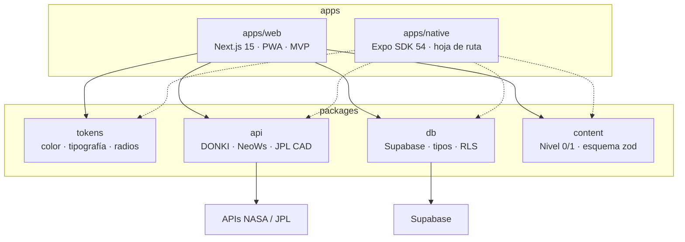

# Arquitectura de frontend — KillaLab

## Decisión de stack: monorepo, web primero, Expo después

No se usa Expo para todo. La landing necesita SEO (los colegios llegan por Google),
proyección en aula y un sistema tipográfico exigente; React Native Web rinde mal en
esos tres puntos. Y el binario nativo no aporta nada que la PWA no cubra hoy.

| | MVP (ahora) | Hoja de ruta |
|---|---|---|
| Superficie | Landing + plataforma web, mobile-first, PWA instalable | App nativa iOS/Android |
| Stack | Next.js 15 (App Router) + TypeScript + Tailwind v4 | Expo SDK 54 + Expo Router |
| Despliegue | Vercel | EAS Build |
| Offline | Service worker: Niveles 0 y 1 abren sin red | Igual, con almacenamiento nativo |

El monorepo (Turborepo + pnpm) existe para que ese segundo paso no sea una reescritura:
`apps/native` se añade y consume los mismos `packages/`.



## Árbol del proyecto

```
killalab/
├── apps/
│   ├── web/                          # ← el MVP
│   │   ├── app/                      # rutas: solo composición, sin lógica
│   │   │   ├── layout.tsx            # fuentes, data-tema, nav, pie, SW
│   │   │   ├── page.tsx              # landing — revalidate 900
│   │   │   ├── globals.css           # tailwind + tokens + @theme inline
│   │   │   ├── misiones/[nivel]/[tema]/
│   │   │   ├── planeta/[slug]/mapa/
│   │   │   ├── tarjetas/[mision]/
│   │   │   ├── notas/ comunidades/ docentes/ perfil/
│   │   │   └── api/eventos/route.ts  # BFF: oculta la API key
│   │   ├── componentes/
│   │   │   ├── ui/                   # Boton · Tarjeta · Badge
│   │   │   ├── dato/                 # ← capa crítica (ver abajo)
│   │   │   ├── layout/               # Nav · Pie · ConmutadorTema · RegistroSW
│   │   │   ├── landing/              # una carpeta = una sección del wireframe
│   │   │   ├── misiones/ formatos/ comunidad/
│   │   ├── lib/formato.ts            # cifras, fechas relativas en es-PE
│   │   ├── public/                   # manifest.webmanifest · sw.js · iconos
│   │   └── next.config.ts
│   └── native/                       # Expo, post-MVP
├── packages/
│   ├── tokens/   tokens.css · tipografia.css · index.ts
│   ├── api/      cliente · cache · nasa/{donki,neows,cad} · fixtures/
│   ├── db/       cliente · servidor · tipos
│   └── content/  esquema.ts · nivel-0/*.json · nivel-1/*.json
├── supabase/migraciones/0001_esquema_inicial.sql
├── docs/
└── turbo.json · pnpm-workspace.yaml · tsconfig.base.json
```

**Nombres:** lo que impone Next.js en inglés (`app`, `public`, `lib`); todo lo demás en
español, igual que los tokens (`--killa-indigo`, `data-tema="oscuro"`).

## `componentes/dato/` es una capa aparte, y ese es el punto

Las tres promesas del producto dejan de ser convenciones que alguien recuerda y pasan a
ser tipos que no compilan sin cumplirse:

- `CifraCientifica` es el **único** sitio que aplica IBM Plex Mono. Un número fuera de
  este componente es un bug de diseño, detectable con un grep.
- `EtiquetaFuente` recibe `fuente` como prop **requerida**. No hay forma de renderizar
  un dato sin decir de dónde salió.
- `AvisoCache` convierte el fallo de la API en contenido: `vivo` / `último dato conocido` /
  `dato de respaldo`, siempre con fecha y siempre con texto además del color.

La política de degradación vive en `packages/api`, no en la UI: `ultimaLlamarada()` nunca
lanza. Devuelve dato vivo, caché vencida o fixture, y declara cuál de los tres es.

## Estrategia de render por ruta

| Ruta | Render | Motivo |
|---|---|---|
| `/` | SSR, `revalidate = 900` | el dato llega pintado en el HTML; el SEO no depende de la NASA |
| `/misiones` y niveles 0–1 | estático (`force-static` + `generateStaticParams`) | tienen que abrir sin red en el aula |
| niveles 2–3 | SSR + Suspense | dependen de DONKI/CAD, se degradan a caché |
| `/notas`, `/planeta/*/mapa` | cliente | arrastre y edición |

Server Components por defecto. `'use client'` solo en cinco sitios: conmutador de tema,
registro del SW, mural de notas, lienzo del mapa y respuesta de misión.

## Sistema de diseño en código

Los tokens del documento de diseño viven una sola vez, en `packages/tokens/src/tokens.css`,
y Tailwind v4 los mapea con `@theme inline` — no hay valores hexadecimales sueltos en
componentes. El tema oscuro se conmuta por `data-tema` en `<html>`, escrito por un script
inline antes del primer pintado para que no haya parpadeo.

Reglas de accesibilidad ya aplicadas en los componentes:
- El ámbar nunca es texto sobre blanco (no llega a AA): solo relleno de botón con tinta encima.
- Ningún estado se comunica solo por color; `Badge` y `AvisoCache` siempre llevan texto.
- Foco visible en turquesa, `prefers-reduced-motion` respetado en `globals.css`.
