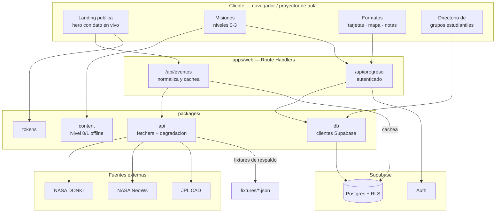
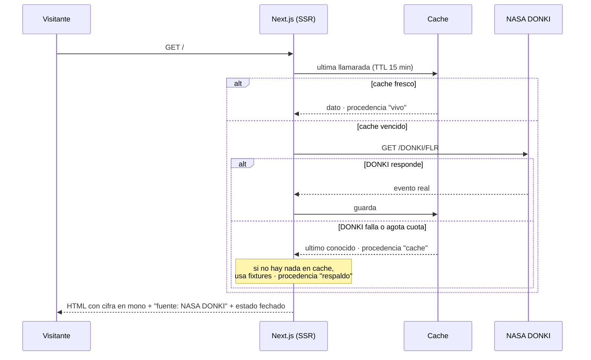
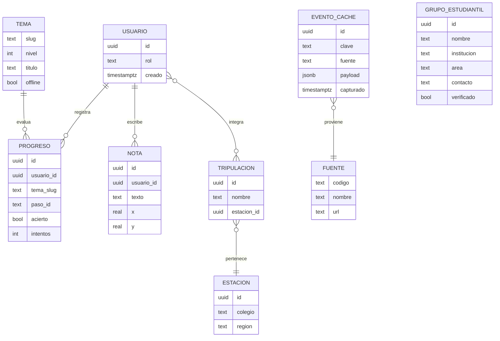
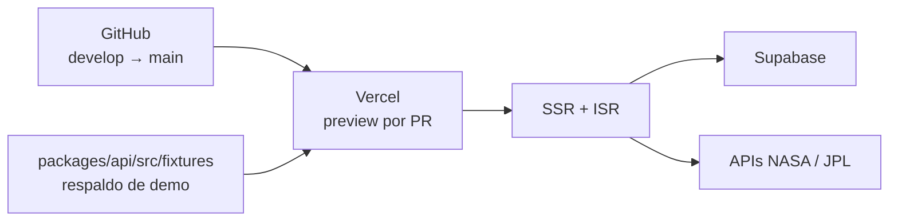

# Arquitectura — KillaLab

Detalle de frontend en [arquitectura-frontend.md](./arquitectura-frontend.md).

## Módulos y comunicación

## Flujo crítico: el dato en vivo del héroe

Es la promesa del producto, así que su ruta de fallo está definida antes que la feliz.

El módulo nunca se oculta ni muestra un placeholder vacío: o hay dato fresco, o hay dato
viejo fechado. Los niveles 0 y 1 no tocan este flujo en absoluto.

## Esquema de base de datos

SQL ejecutable en [`supabase/migraciones/0001_esquema_inicial.sql`](../supabase/migraciones/0001_esquema_inicial.sql).

Los temas viven como JSON versionado en `packages/content`, no en Postgres: así el
Nivel 0 se sirve estático y funciona sin conexión. Postgres solo guarda lo que es del
usuario (progreso, notas) y lo compartido (directorio, caché).

## Despliegue

