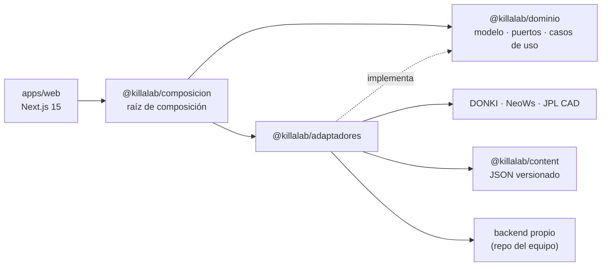

# Arquitectura

KillaLab sigue **puertos y adaptadores** (arquitectura hexagonal). El dominio
declara qué necesita del mundo; los adaptadores lo implementan; una raíz de
composición decide cuál se enchufa.



La flecha va en un solo sentido. **Una pantalla que importe
`@killalab/adaptadores` rompe el diseño**, porque sería la UI dependiendo de que
la fuente sea la NASA y no otra cosa.

## Los paquetes

| Paquete | Qué contiene | Puede depender de |
|---|---|---|
| `dominio` | modelo, puertos, casos de uso | **nada** |
| `adaptadores` | NASA, catálogo JSON, caché, reloj, backend HTTP | `dominio`, `content`, `zod` |
| `composicion` | cablea puertos con adaptadores según entorno | `dominio`, `adaptadores` |
| `tokens` | CSS del sistema de diseño | nada |
| `content` | JSON crudo de los temas, sin lógica | nada |

Si algo del dominio necesita salir al mundo, es un puerto nuevo, no un import.

## Los puertos

| Puerto | Lo implementa hoy |
|---|---|
| `PuertoClimaEspacial` | DONKI, o `apps/fake-api` en desarrollo |
| `PuertoAsteroides` | JPL CAD y NeoWs |
| `PuertoRespaldo` | respuestas guardadas en `adaptadores/src/nasa/respaldos/` |
| `PuertoAlmacenTemporal` | caché en memoria del proceso |
| `PuertoCatalogo` | JSON de `@killalab/content`, validado con zod al importar |
| `PuertoProgreso`, `PuertoDirectorio` | backend propio por HTTP, o dobles locales |
| `PuertoReloj` | `new Date()` |

## Degradación de datos

La política vive en el dominio
(`dominio/src/casos-uso/observar-clima-espacial.ts`), no en el cliente HTTP:

```
vivo → caché fresco → caché vencido → respaldo en disco
```

Los adaptadores **lanzan** cuando la fuente falla. Qué hacer con esa falla lo
decide el caso de uso. Por eso se puede probar la cadena entera con puertos
falsos, sin red y sin la NASA.

Ninguna pantalla se rompe ni se oculta: se muestra el último dato conocido, con su
fecha y su etiqueta de procedencia.

## El backend

Lo construye el equipo en un repo aparte. Entra por `PuertoProgreso` y
`PuertoDirectorio`, y se activa con `KILLALAB_BACKEND_URL`. Sin esa variable la web
arranca igual: los dobles locales cumplen el mismo contrato y se declaran
`disponible: false`, así que la interfaz lo dice en pantalla en vez de fingir que
guardó algo.

Cuando el contrato se cierre, el único archivo que cambia es
`adaptadores/src/plataforma/backend-killalab.ts`.

## Entorno

| Variable | Sin ella | Con ella |
|---|---|---|
| `KILLALAB_NASA_BASE` / `KILLALAB_JPL_BASE` | NASA y JPL reales | `apps/fake-api`, todo dato sale etiquetado `simulado` |
| `KILLALAB_BACKEND_URL` | progreso en memoria y directorio vacío | backend propio por HTTP |
| `NASA_API_KEY` | `DEMO_KEY`, 30 peticiones por hora | la llave real |
