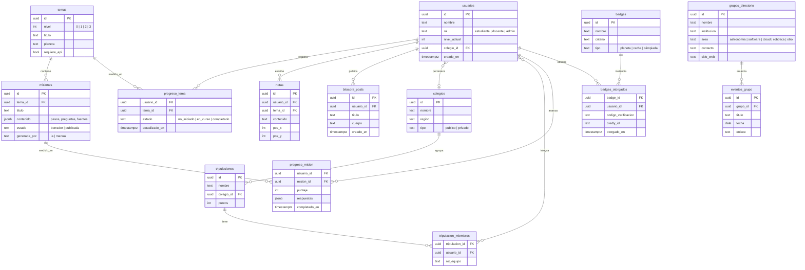

# Esquema de base de datos — KillaLab (Supabase / Postgres)

Borrador para el MVP. `auth.users` lo gestiona Supabase Auth; el resto vive en el
esquema `public`.

## Notas de implementación

- **RLS activado** en todas las tablas. El estudiante solo lee/escribe sus
  propias filas de `progreso_*` y `notas`; `temas`, `misiones` (publicadas),
  `grupos_directorio` y `eventos_grupo` son de lectura pública.
- `misiones.contenido` y `progreso_mision.respuestas` en `jsonb`, validados con
  Zod en el BFF antes de escribir.
- `grupos_directorio` arranca con 8–12 filas reales cargadas a mano (seed).
- Migraciones versionadas en `packages/db/migrations`.
